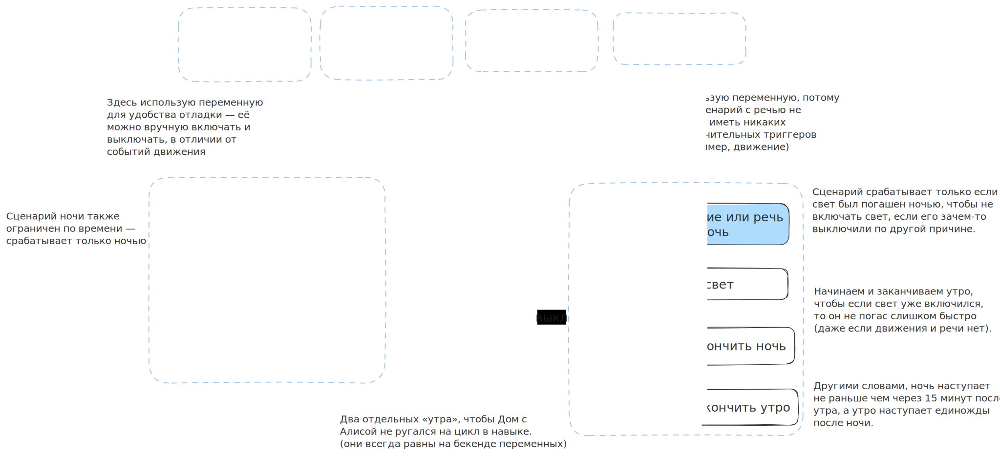

# Переменные для умного дома с Алисой

Навык, который позволяет создавать виртуальные устройства и использовать их в навыках.
Каждое устройство может быть включено или выключено из сценария, а так же быть триггером для запуска оного.

Навык выполнен в виде функции в Яндекс Облаке.

## Quickstart

Пользовательский интерфейс: https://d5dfjqdqcf4dhum6cf1c.apigw.yandexcloud.net/

1. Авторизоваться с помощью аккаунта Яндекса. Должен появиться пустой черный блок «Переменные».
2. В левом меню создать новую переменную. Например, «тест».
3. Перетащить в черный блок «Переменные» присвоение значения для этой переменной. Чтобы получилось «[тест] := …»
4. В качестве значения переменной использовать блок «истина» из левой панели. Должно получиться «[тест] := [истина]» внутри черного блока «Переменные».
5. Нажать в правом верхнем углу кнопку «Сохранить».
6. В приложении «Дом с Алисой» в навыки появиться новое устройство — «Переменная тест» (в зависимости от выбранного имени переменной в п. 2).
7. Это устройство можно использовать в сценариях, можно его включать и выключать их приложения.

## Пример использования

Сценарий, который ночью выключает свет, а утром (при движении людей) — его включает. При этом сценарий не мешает обычной жизни. 



Желтое — переменные, синее — отдельные сценарии.

## API

Доступ к API требует авторизации через Яндекс. Его можно получить, например, [здесь](https://oauth.yandex.ru/authorize?response_type=token&client_id=1bcfbbc93225437497bf2023d59fcabb).

Также потребуется иметь идентифкатор функции в Яндекс Облаке, где развернут этот навык.

* Получить список переменных
   ```shell
   curl https://functions.yandexcloud.net/d4eu1j29elvh2n4o6rkv?vars=get \
        -H 'X-Auth-Token: <Token>'
   ```
* Добавить новую переменную
   ```shell
   curl -X PATCH \
        https://functions.yandexcloud.net/d4eu1j29elvh2n4o6rkv?vars=set \
        --data-urlencode 'Name=1' \
        -H 'X-Auth-Token: <Token>'
   ```
* Удалить переменную
   ```shell
   curl -X PATCH
        https://functions.yandexcloud.net/d4eu1j29elvh2n4o6rkv?vars=set \
        --data-urlencode 'Name=x' \
        -H 'X-Auth-Token: <Token>'
   ```

Также доступен пользовательский интерфейс!

## Выражения

Каждая переменная может иметь значение `1` или `0` (тогда их можно менять из сценариев), либо же являться выражением и вычисляться на основе значений других переменных.

Для записи формулы используется [обратная польcкая запись](https://ru.wikipedia.org/wiki/%D0%9E%D0%B1%D1%80%D0%B0%D1%82%D0%BD%D0%B0%D1%8F_%D0%BF%D0%BE%D0%BB%D1%8C%D1%81%D0%BA%D0%B0%D1%8F_%D0%B7%D0%B0%D0%BF%D0%B8%D1%81%D1%8C) и все операнды разделяются пробелами.

Например, булева формула `z & (x | y)` будет записана как `z x y | &`, где `x`, `y` и `z` — некоторые другие переменные.

## Создание и запуск навыка

**Подготовьте всё необходимое:**

1. Зарегистрируйте OAuth приложение: https://oauth.yandex.ru/client/new
2. Создайте в консоли Яндекс Облака:
    - Базу данных YDB
    - Cloud Function (Python 3.12)
3. Инициализируйте базу данных:
    ```sql
    CREATE TABLE users(
        uid Int64,
        expressions Yson,
        PRIMARY KEY (uid)
    );
    ```

**Настройте навык Алисы:**

1. Создайте новый диалог «Умный дом»: https://dialogs.yandex.ru/developer
2. Заполните основные настройки навыка самостоятельно.
    - в качестве Backend используйте ранее созданную функцию в Яндекс Облаке
3. На вкладке «связка аккаунтов» вашего навыка настройте авторизацию, используя данные из первого шага:
    - Идентификатор приложения: `<ClientID>`
    - Секрет приложения: `<Client secret>`
    - URL авторизации: `https://oauth.yandex.ru/authorize`
    - URL для получения токена: `https://oauth.yandex.ru/token`
    - URL для обновления токена: `https://oauth.yandex.ru/token`

**Настройте функцию из первого шага:**

1. Используйте этот репозиторий в качестве исходного кода функции
2. Укажите переменные окружения в настройках функции:
    - `YDB_DATABASE`: Имя вашей базы данных YDB
    - `YDB_ENDPOINT`: Адрес для подключения к БД
    - `OAUTH_TOKEN`: Токен в Яндекс.Диалогах (получить [здесь](https://oauth.yandex.ru/authorize?response_type=token&client_id=c473ca268cd749d3a8371351a8f2bcbd))
    - `SKILL_ID`: идентификатор вашего навыка
    - `CLIENT_ID`: идентификатор вашего приложения
    - `URL`: URL вашей функции (например, `https://functions.yandexcloud.net/aaaaaaaaaaaaaaaaaaaa`)
3. Сконфигурируйте сервисный аккаунт для функции и убедитесь, что у него есть права доступа к базе данных.
    - Опционально, можно настроить API Gateway.

**Используйте навык!** _Возможно придется исправить мелкие баги._
